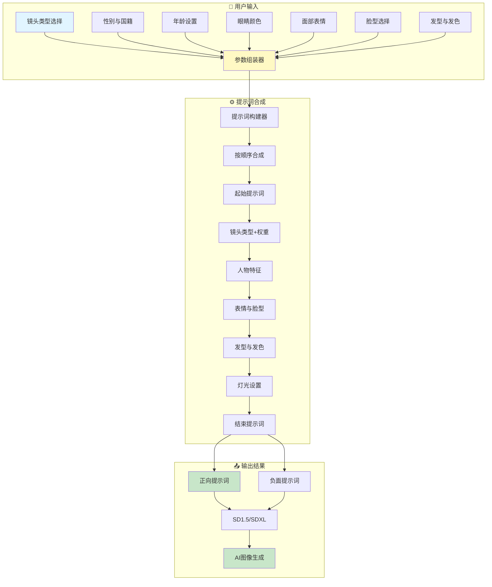

# 🎨 fork-comfyui-portrait-master-zh-cn - ComfyUI肖像提示词生成器(中文版)


## 📖 项目简介

fork-comfyui-portrait-master-zh-cn是ComfyUI的肖像提示词生成器简体中文版,用于快速生成高质量的人像摄影提示词,支持镜头类型、人物特征、灯光效果等多种参数配置。

## 📦 项目来源

- **原项目**: [ZHO-ZHO-ZHO/comfyui-portrait-master-zh-cn](https://github.com/ZHO-ZHO-ZHO/comfyui-portrait-master-zh-cn)
- **原作者**: ZHO-ZHO-ZHO
- **开源协议**: GNU General Public License v3.0 (GPL-3.0)
- **Fork时间**: 2024年

## 🔧 二次开发内容

本项目为原项目的本地备份,未进行实质性修改,主要用于:
- 学习Stable Diffusion的提示词工程
- 研究AI图像生成的参数优化
- 了解ComfyUI工作流的设计方法

## 提示词生成架构 | Prompt Generation Architecture



## 参数层级关系 | Parameter Hierarchy

```mermaid
mindmap
  root((肖像提示词<br/>生成器))
    镜头设置
      头像特写
      肩部肖像
      半身像
      全身像
      脸部肖像
      镜头权重调节
    人物特征
      性别
        男性
        女性
      国籍
        193国家可选
        支持混合国籍
      年龄
        自由设定
      眼睛
        8种颜色
        虹膜细节
        圆形瞳孔
    面部细节
      表情
        24种表情
        表情权重
      脸型
        12种脸型
      皮肤
        皮肤细节
        毛孔设置
        瑕疵控制
        雀斑/酒窝/痣
    发型设置
      发型
        20种发型
      发色
        9种颜色
      蓬松度
    灯光系统
      灯光类型
        32种灯光
      灯光方向
        10个方向
    扩展功能
      自定义提示词
        起始提示词
        补充提示词
        结束提示词
      真实感增强
      负面提示词


## 项目介绍 | Info

- 人物肖像提示词生成模块，优化肖像生成，选择永远比填空更适合人类！

- 优化 + 汉化 自 [ComfyUI Portrait Master](https://github.com/florestefano1975/comfyui-portrait-master.git)

- 版本：V2.0

## 参数说明 | Parameters

- 镜头类型：头像、肩部以上肖像、半身像、全身像、脸部肖像
- 性别：女性、男性
- 国籍_1：193个国家可选
- 国籍_2：193个国家可选
- 眼睛颜色：琥珀色、蓝色等8种 🆕
- 面部表情：开心、伤心、生气、惊讶、害怕等24种
- 脸型：椭圆形、圆形、梨形等12种
- 发型：法式波波头、卷发波波头、不对称剪裁等20种
- 头发颜色：金色、栗色、灰白混合色等9种 🆕
- 灯光类型：柔和环境光、日落余晖、摄影棚灯光等32种 🆕
- 灯光方向：上方、左侧、右下方等10种 🆕
- 起始提示词：写在开头的提示词
- 补充提示词：写在中间用于补充信息的提示词
- 结束提示词：写在末尾的提示词
- 提高照片真实感：可强化真实感 🆕
- 负面提示词：新增负面提示词输出 🆕

## 提示词合成顺序 | Prompt composition order
- 起始提示词
- 镜头类型 + 镜头权重
- 国籍 + 性别 + 年龄
- 眼睛颜色 🆕
- 面部表情 + 面部表情权重
- 脸型
- 发型
- 头发颜色 🆕
- 头发蓬松度
- 补充提示词
- 皮肤细节
- 皮肤毛孔
- 皮肤瑕疵
- 酒窝
- 雀斑
- 痣
- 眼睛细节
- 虹膜细节
- 圆形虹膜
- 圆形瞳孔
- 面部对称性
- 灯光类型 + 灯光方向 🆕
- 结束提示词
- 提高照片真实感 🆕

## 自定义 | Customizations

可将需要自定义增加的内容写到lists文件夹中对应的json文件里（如发型、表情等）

## 使用建议 | Practical advice

皮肤和眼睛细节等参数过高时可能会覆盖所选镜头的设置。在这种情况下，建议减小皮肤和眼睛的参数值，或者插入否定提示(closeup, close up, close-up:1.5)，并根据需要修改权重。

## 安装 | Install

1. `cd custom_nodes`
2. `git clone https://github.com/ZHO-ZHO-ZHO/comfyui-portrait-master-zh-cn.git`
3. 重启 ComfyUI

## 工作流 | Workflow

### V2.0工作流

- [V2.0 For SD1.5 or SDXL](https://github.com/ZHO-ZHO-ZHO/comfyui-portrait-master-zh-cn/blob/main/workflows/Portrait%20Master%20%E7%AE%80%E4%BD%93%E4%B8%AD%E6%96%87%E7%89%88%20V2.0%E3%80%90Zho%E3%80%91.json)


- [V2.0 For SDXL Turbo（non-commercial）](https://github.com/ZHO-ZHO-ZHO/comfyui-portrait-master-zh-cn/blob/main/workflows/Portrait%20Master%20%E7%AE%80%E4%BD%93%E4%B8%AD%E6%96%87%E7%89%88%20SDXL%20Turbo%20V2.0%E3%80%90Zho%E3%80%91.json)


- [V2.0 for SAG + SVD 视频工作流](https://github.com/ZHO-ZHO-ZHO/comfyui-portrait-master-zh-cn/blob/main/workflows/Portrait%20Master%20%E7%AE%80%E4%BD%93%E4%B8%AD%E6%96%87%E7%89%88%20V2.0%20%2B%20SAG%20%2B%20SVD%E3%80%90Zho%E3%80%91.json)


https://github.com/ZHO-ZHO-ZHO/comfyui-portrait-master-zh-cn/assets/140084057/8e3915be-2d45-4f94-af0c-0a270378712b


### V1.0工作流

- [SD1.5 or SDXL](https://github.com/ZHO-ZHO-ZHO/comfyui-portrait-master-zh-cn/blob/main/workflows/Portrait%20Master%20%E7%AE%80%E4%BD%93%E4%B8%AD%E6%96%87%E7%89%88%E3%80%90Zho%E3%80%91.json)


- [SDXL Turbo（non-commercial）](https://github.com/ZHO-ZHO-ZHO/comfyui-portrait-master-zh-cn/blob/main/workflows/Portrait%20Master%20%E7%AE%80%E4%BD%93%E4%B8%AD%E6%96%87%E7%89%88%20SDXL%20Turbo%E3%80%90Zho%E3%80%91.json)


## 更新日志 | Changelog

20231218

- 更新为V2.0版，新增6项参数，扩充2项参数，优化代码：
    - 眼睛颜色（8种）
    - 头发颜色（9种）
    - 灯光类型（32种）
    - 灯光方向（10种）
    - 提高照片真实感
    - 负面提示词
    - 镜头类型（+3种）
    - 发型（+19种）

20231216

- 完成代码优化，将原本读取txt文件调整成读取json文件，更加方便使用、自定义和扩展
  

20231215

- 对 [ComfyUI Portrait Master](https://github.com/florestefano1975/comfyui-portrait-master.git) 完成汉化

## Credits

[ComfyUI Portrait Master](https://github.com/florestefano1975/comfyui-portrait-master.git)


